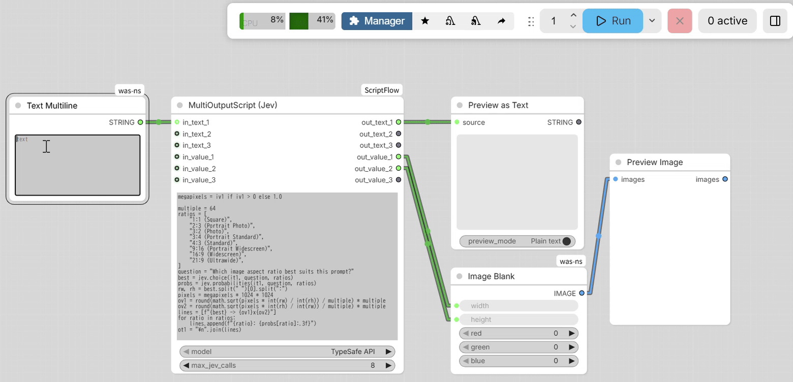

# ComfyUI-ScriptFlow
[en | [ja](README.ja.md)]

**Version:** 1.3.0
**License:** GPL-3.0

Safe Python-like script node for ComfyUI with a System One decision model.
Ask yes/no, choice, and score questions via TypeSafe AI's Jev API, with local GGUF LLMs as a fallback, and use the answer directly in an `if` statement.



`MultiOutputScript (Jev)` picks an aspect ratio for a text prompt through the TypeSafe API, lists every ratio's probability, and passes the width and height to an image node.

A simplified version of the demo: connect a text prompt to `in_text_1`, and the answer picks the width and height.

```python
if jev.yes(it1, "Does a portrait orientation suit this prompt?"):
    ov1, ov2 = 832, 1280
else:
    ov1, ov2 = 1280, 832
```

A System One model answers with probabilities in a single fast pass instead of generating text, so the answer can drive workflow logic directly.

Multiple inputs and outputs let one node handle math, logic, text editing, conditional routing, resolution selection, filename generation, and more — work that previously took several basic nodes. Scripts run in a restricted interpreter with no file or OS access.

## Installation

1. Navigate to the `ComfyUI/custom_nodes/` directory.
2. Clone this repository:
   ```bash
   git clone https://github.com/kantan-kanto/ComfyUI-ScriptFlow
   ```
3. Restart ComfyUI.

The `MultiOutputScript` and `centi` nodes need no extra packages. `MultiOutputScript (Jev)` needs the setup below for the backend you use.

### For `MultiOutputScript (Jev)`

#### TypeSafe API

1. Install the SDK in the Python environment that runs ComfyUI:
   ```bash
   pip install typesafe-sdk
   ```
2. Create `api_key.txt` in the actual installation directory of this custom node and add your TypeSafe API key (single line, no quotes):
   ```
   ComfyUI/custom_nodes/<your-installation-folder>/api_key.txt
   ```
   The key is read from this file on every run. `api_key.txt` is listed in `.gitignore`; never commit it.

#### Local models (fallback)

- Install [llama-cpp-python](https://github.com/JamePeng/llama-cpp-python) in the Python environment that runs ComfyUI. Tested with the JamePeng fork and the upstream [abetlen/llama-cpp-python](https://github.com/abetlen/llama-cpp-python) 0.3.35.
- Put an instruction-tuned GGUF model in `ComfyUI/models/LLM` (or `models/text_encoders`). The GGUF must include a chat template (`tokenizer.chat_template` metadata), as most instruction-tuned GGUFs do. Tested with Qwen3.5-9B Q8_0 and Gemma-4-E4B Q8.

## Key Features
- Multiple inputs: freely combine numeric and text inputs.
- Calculations and logic: supports arithmetic, comparison, and simple conditional branching.
- Multiple outputs: pass results to downstream nodes via separate output ports.
- AI decisions: `jev.yes` / `jev.choice` / `jev.score` in `MultiOutputScript (Jev)`, with probabilities, through TypeSafe AI's Jev API or a local GGUF model as a fallback.
- Safer execution: scripts run in an AST interpreter with restricted syntax and no file/OS access. Only the Jev node's `jev` functions reach a model or the TypeSafe API.

## Use Cases
- In Wan2.2 I2V workflows, automatically select a recommended resolution
  (512×384 or 384×512) based on whether the input image is portrait or landscape.
- Batch-generate file names (e.g., local LLM prompt history, output logs).
- Apply conditional logic to control workflow behavior (e.g., switch parameters or routes based on inputs).
- Parse and transform LLM outputs into structured values for downstream nodes.
- Dynamically generate numeric parameters (e.g., seeds, thresholds, scaling values) using custom calculations.
- Pick an aspect ratio and size for a text prompt before generation, with the probability of every ratio (Jev node default script).
- Route workflows by the meaning of text, e.g. check whether a prompt describes a night scene or classify its main subject.

## Nodes

### `MultiOutputScript`
**Category:** `utils`

Inputs (optional, connectable):
- `in_text_1` (accepts any input; validated as `str` at runtime)
- `in_text_2` (accepts any input; validated as `str` at runtime)
- `in_text_3` (accepts any input; validated as `str` at runtime)
- `in_value_1` (accepts any input; validated as `int` or `float` at runtime)
- `in_value_2` (accepts any input; validated as `int` or `float` at runtime)
- `in_value_3` (accepts any input; validated as `int` or `float` at runtime)
- `code` (multiline string)

Outputs:
- `out_text_1` (STRING)
- `out_text_2` (STRING)
- `out_text_3` (STRING)
- `out_value_1` (INT)
- `out_value_2` (INT)
- `out_value_3` (INT)

Notes on numeric outputs:
- Outputs are `INT`.
- If you need `FLOAT` values from integer inputs, use the `centi` node.
- If a value is a float, the fractional part is truncated on output.
- If you prefer rounding or ceiling, handle it in the script (e.g., `round(...)`, `math.ceil(...)`).

### Script Variables
Use the following variables inside `code`:
- Inputs: `it1`, `it2`, `it3`, `iv1`, `iv2`, `iv3`
- Outputs: `ot1`, `ot2`, `ot3`, `ov1`, `ov2`, `ov3`

Unassigned outputs default to `None`.

### Script Example
```python
# Example: keep landscape at 512x384, portrait at 384x512
# Connect GetImageSize width/height to in_value_1/in_value_2
# iv1: image width, iv2: image height
w, h = iv1, iv2
ov1, ov2 = (512, 384) if w >= h else (384, 512)
```

### `MultiOutputScript (Jev)`
**Category:** `utils`

Same inputs, outputs, and script rules as `MultiOutputScript`, plus a `jev` namespace that asks [Jev](https://typesafe.ai), TypeSafe AI's decision model, typed questions about text and lets scripts branch on the answer.

- **TypeSafe API** (primary): sends the questions to Jev over the internet.
- **Local GGUF model** (fallback): for when the Jev API is not available, or when text must stay on your machine. It approximates Jev-style decisions with a general instruction-tuned model, reading the answer from next-token probabilities of lettered options in one forward pass, following [SemIf (OpenJev)](https://github.com/TheoLeeCJ/SemIf-OpenJev). No text is generated and nothing is sent over the network. Answers and probabilities differ from Jev's.

Scripts are the same for both. See [Installation](#installation) for the setup of each backend.

Extra inputs:
- `model`: `TypeSafe API`, or a local GGUF model (`mmproj-*` files are hidden).
- `max_jev_calls` (INT, default 8): maximum API requests or model evaluations per run. Identical questions within a run are asked only once.

Functions (`state` is a string, dict, or list; text only):
- `jev.yes(state, question[, threshold])` → `bool` (yes-probability ≥ `threshold`, default `0.5`)
- `jev.noul(state, question)` → yes-probability (`0.0`–`1.0`). Compare it with a threshold; using it directly as a condition raises an error.
- `jev.choice(state, question, options)` → the most likely option (`str`). `options` is a list of labels, or a dict of labels to descriptions (2–16 options for local models).
- `jev.probabilities(state, question, options)` → `dict` of each option to its probability (sums to `1.0`). Same `options` as `jev.choice`; asking both with the same arguments asks the model once.
- `jev.score(state, question, levels)` → expected level (`float`, `0` to `len(levels) - 1`) for ordered level descriptions (2–16 levels for local models)

```python
# it1: a prompt text
if jev.yes(it1, "Does this prompt describe a night scene?", 0.7):
    ov1 = 30
else:
    ov1 = 20

kind = jev.choice(it1, "Which orientation suits this prompt?", ["portrait", "landscape"])
ov2, ov3 = (384, 512) if kind == "portrait" else (512, 384)

probs = jev.probabilities(it1, "Which orientation suits this prompt?", ["portrait", "landscape"])
ot1 = f"{kind} (portrait: {probs['portrait']:.3f}, landscape: {probs['landscape']:.3f})"
```

The node's default script picks one of eight aspect ratios for the prompt in `it1`, sizes it to the megapixels in `in_value_1` (default `1.0` when unconnected; width and height rounded to multiples of 64), outputs the width and height to `out_value_1` / `out_value_2`, and lists every ratio's probability in `out_text_1`.

Each function asks one question. With the TypeSafe API it maps to one `system_one` request of the [TypeSafe Python SDK](https://pypi.org/project/typesafe-sdk/):

| ScriptFlow | TypeSafe SDK |
| --- | --- |
| `jev.noul(state, q)` | `client.system_one(state=state, questions={"q": Noul(instructions=q)}).answers["q"].noul` |
| `jev.yes(state, q, t)` | `... .answers["q"].noul >= t` |
| `jev.choice(state, q, options)` | `client.system_one(state=state, questions={"q": Choice(instructions=q, criteria=options)}).answers["q"].choice` |
| `jev.probabilities(state, q, options)` | `... .answers["q"].probabilities` (same request as `jev.choice`) |
| `jev.score(state, q, levels)` | `client.system_one(state=state, questions={"q": Score(instructions=q, criteria=levels)}).answers["q"].score` |

A list of `options` is sent as `criteria={label: None, ...}`. `confidence`, the Score level probabilities, and Noul `criteria` are not exposed.

Notes:
- The TypeSafe API sends `state` and questions over the internet. Do not use it with text you cannot share externally.
- A local question takes one forward pass (about 1–1.5 s with a 4B–9B model on GPU). The model is loaded on the first question of each run (several seconds) and unloaded when the run ends to free VRAM for the rest of the workflow.
- Local probabilities are uncalibrated and depend on the model; test thresholds on your own inputs.
- `MultiOutputScript` never loads a model or makes network requests; `jev` is not available there.
- This project is independent and not affiliated with TypeSafe AI.

### `centi`
**Category:** `utils`

Inputs (optional, connectable):
- `int_1` (INT)
- `int_2` (INT)
- `int_3` (INT)

Outputs:
- `float_1` (FLOAT) = `int_1 / 100`
- `float_2` (FLOAT) = `int_2 / 100`
- `float_3` (FLOAT) = `int_3 / 100`

Notes:
- If `int_n` is not connected, the corresponding `float_n` output is `None`.
- The node is intentionally minimal and connector-only.

---

## Execution Environment
The script is parsed with Python AST and evaluated by ScriptFlow's safe interpreter. It supports common workflow logic such as assignment, arithmetic, branching, loops, user-defined helper functions, dictionaries, lists, strings, and selected methods.

### Allowed functions
- `len`, `min`, `max`, `sum`, `abs`, `round`
- `int`, `float`, `str`, `bool`
- `sorted`, `reversed`
- `enumerate`, `range`, `zip`
- `any`, `all`, `pow`, `divmod`
- `list`, `dict`, `tuple`
- `jev.yes`, `jev.noul`, `jev.choice`, `jev.probabilities`, `jev.score` (`MultiOutputScript (Jev)` only; see [its section](#multioutputscript-jev))

### Allowed namespaces
- `random`: `random`, `randint`, `uniform`, `choice`
- `datetime`: `datetime.now`, `date.today`, date/time fields such as `year`, `month`, `day`, `hour`, `minute`, `second`, plus `isoformat` and `strftime` (`strftime` requires v1.2.0 or later)
- `math`: `ceil`, `floor`, `sqrt`, `sin`, `cos`, `tan`, `asin`, `acos`, `atan`, `atan2`, `log`, `log10`, `exp`, `pow`, `fabs`, `isfinite`, `pi`, `e`, `tau`

### Allowed methods
- `str`: `replace`, `find`, `strip`, `split`, `splitlines`, `startswith`, `endswith`, `join`, `lower`, `upper`
- `list`: `append`

### Not allowed
- `import` statements
- file access (`open`, etc.)
- OS operations (`os`, `sys`)
- dynamic Python execution
- blocked syntax in safe mode: `Import`, `ImportFrom`, `Global`, `Nonlocal`, `ClassDef`, `Try`, `With`, `AsyncWith`, `Lambda`, `Delete`, `Yield`, `Await`
- blocked calls in safe mode: dynamic execution, file/input access, runtime namespace inspection, and dynamic attribute mutation

### Execution Notes
- Using `random` or `datetime` makes outputs non-deterministic.
- `datetime.strftime(...)` is supported in v1.2.0 or later for concise timestamp formatting:
  ```python
  now = datetime.datetime.now()
  ot1 = now.strftime("%Y%m%d%H%M%S")
  ```
- For versions earlier than v1.2.0, format the same timestamp manually:
  ```python
  now = datetime.datetime.now()
  ot1 = f'{now.year:04d}{now.month:02d}{now.day:02d}{now.hour:02d}{now.minute:02d}{now.second:02d}'
  ```
- Type mismatches raise an error and stop execution.
- Safe mode validates AST before evaluation and stops scripts that exceed the step or loop limit.
- Use only trusted scripts/workflows. Do not run untrusted code from unknown sources.

## Examples

### Example Workflow

```
examples/
 ├─ example_workflow.json
```

## Application Recipes

### Convert `LLM Dialogue Cycle` transcript text to `dialogue_segments_json`

<details>
<summary>Show ComfyUI-LLM-Session transcript conversion recipe</summary>

`ComfyUI-LLM-Session` returns the full result of `LLM Dialogue Cycle` as `transcript_text`.
You can connect that text to `MultiOutputScript.in_text_1` and paste the script below into
the `code` field to generate a speaker-tagged JSON text for downstream dialogue TTS nodes.

Recommended workflow:

```text
LLM Dialogue Cycle
  -> transcript_text
  -> MultiOutputScript.in_text_1
  -> MultiOutputScript.out_text_1
  -> dialogue_segments_json input of a TTS node
```

Paste this code into `MultiOutputScript.code`:

```python
# Convert ComfyUI-LLM-Session "LLM Dialogue Cycle" transcript_text
# into dialogue_segments_json for TTS.
# Only text inside Japanese corner quotes 「...」 is used as spoken dialogue.
#
# Input:
#   it1: transcript_text
#
# Output:
#   ot1: JSON text with schema "kantan.dialogue.v1"
#
# Expected transcript lines:
#   [2026-05-16T12:00:00] USER -> A: initial prompt
#   [2026-05-16T12:00:01] A: 彼女は少し考えた。「こんにちは。」
#   [2026-05-16T12:00:02] B: 彼は笑った。「やあ。」「調子はどう？」
#
# The parser also accepts the unicode arrow form:
#   USER → A:

def json_escape(value):
    s = str(value)
    s = s.replace("\\", "\\\\")
    s = s.replace('"', '\\"')
    s = s.replace("\n", "\\n")
    s = s.replace("\r", "\\r")
    s = s.replace("\t", "\\t")
    return s

def extract_spoken_text(value):
    source = str(value)
    parts = []
    position = 0

    while position < len(source):
        start = source.find("「", position)
        if start < 0:
            position = len(source)
        else:
            end = source.find("」", start + 1)
            if end < 0:
                position = len(source)
            else:
                spoken = source[start + 1:end].strip()
                if spoken:
                    parts.append(spoken)
                position = end + 1

    return "\n".join(parts)

transcript = str(it1 or "")
lines = transcript.splitlines()
utterances = []
current = None

for raw_line in lines:
    line = str(raw_line)
    speaker = None
    text = None
    timestamp = ""

    if line.startswith("[") and "] " in line:
        close_index = line.find("] ")
        timestamp = line[1:close_index]
        rest = line[close_index + 2:]

        if rest.startswith("A:"):
            speaker = "A"
            text = rest[2:].strip()
        elif rest.startswith("B:"):
            speaker = "B"
            text = rest[2:].strip()
        elif rest.startswith("USER -> A:"):
            speaker = "USER"
            text = rest[len("USER -> A:"):].strip()
        elif rest.startswith("USER → A:"):
            speaker = "USER"
            text = rest[len("USER → A:"):].strip()

    if speaker == "A" or speaker == "B":
        if current is not None:
            utterances.append(current)
        current = {
            "speaker": speaker,
            "text": text,
            "timestamp": timestamp,
        }
    else:
        if current is not None:
            if current["text"]:
                current["text"] = current["text"] + "\n" + line
            else:
                current["text"] = line

if current is not None:
    utterances.append(current)

items = []
index = 1
for u in utterances:
    spoken_text = extract_spoken_text(u["text"])
    if not spoken_text:
        continue

    item = (
        '{"index":'
        + str(index)
        + ',"speaker":"'
        + json_escape(u["speaker"])
        + '","text":"'
        + json_escape(spoken_text)
        + '","timestamp":"'
        + json_escape(u["timestamp"])
        + '"}'
    )
    items.append(item)
    index = index + 1

ot1 = (
    '{"schema":"kantan.dialogue.v1",'
    + '"source":"ComfyUI-LLM-Session LLM Dialogue Cycle",'
    + '"utterances":['
    + ",".join(items)
    + "]}"
)
```

The resulting `out_text_1` is a JSON string like this:

```json
{
  "schema": "kantan.dialogue.v1",
    "source": "ComfyUI-LLM-Session LLM Dialogue Cycle",
    "utterances": [
      {
        "index": 1,
        "speaker": "A",
        "text": "こんにちは。",
        "timestamp": "2026-05-16T12:00:01"
      },
      {
        "index": 2,
        "speaker": "B",
        "text": "やあ。\n調子はどう？",
        "timestamp": "2026-05-16T12:00:02"
      }
  ]
}
```

Notes:

- `USER -> A` / `USER → A` is intentionally skipped so TTS reads only character dialogue.
- Multiline model output is kept inside the previous `A` or `B` utterance.
- Only text inside `「...」` is emitted to `utterances[].text`; narration and inner thoughts outside quotes are skipped.
- If one utterance contains multiple quoted lines, they are joined with newlines.
- Utterances without `「...」` are omitted from the TTS script.
- `out_text_2`, `out_text_3`, and numeric outputs are unused by this recipe.

</details>

## License

This project is licensed under the **GNU General Public License v3.0**.

**Copyright (C) 2026 kantan-kanto**  
GitHub: https://github.com/kantan-kanto

This program is free software: you can redistribute it and/or modify it under the terms of the GNU General Public License as published by the Free Software Foundation, either version 3 of the License, or (at your option) any later version.

This program is distributed in the hope that it will be useful, but WITHOUT ANY WARRANTY; without even the implied warranty of MERCHANTABILITY or FITNESS FOR A PARTICULAR PURPOSE. See the GNU General Public License for more details.

You should have received a copy of the GNU General Public License along with this program. If not, see https://www.gnu.org/licenses/.

## Support

- **Issues**: Report bugs or request features via GitHub Issues
- **Documentation**: See [CHANGELOG.md](CHANGELOG.md) for version history
- **Examples**: Check [examples/](examples/) for workflow templates

---

## Changelog

See [CHANGELOG.md](CHANGELOG.md) for detailed version history.

### Current Version: 1.3.0
- Added `MultiOutputScript (Jev)` node with a `jev` namespace for typed decisions in scripts
- Added `jev.yes`, `jev.noul`, `jev.choice`, `jev.probabilities`, and `jev.score`
- Added TypeSafe API backend with the API key read from `api_key.txt`
- Added local GGUF backend through llama-cpp-python, adapted from SemIf (OpenJev)
- Added a default script that picks one of eight aspect ratios and sizes it from megapixels
- Kept `MultiOutputScript` and `centi` unchanged
